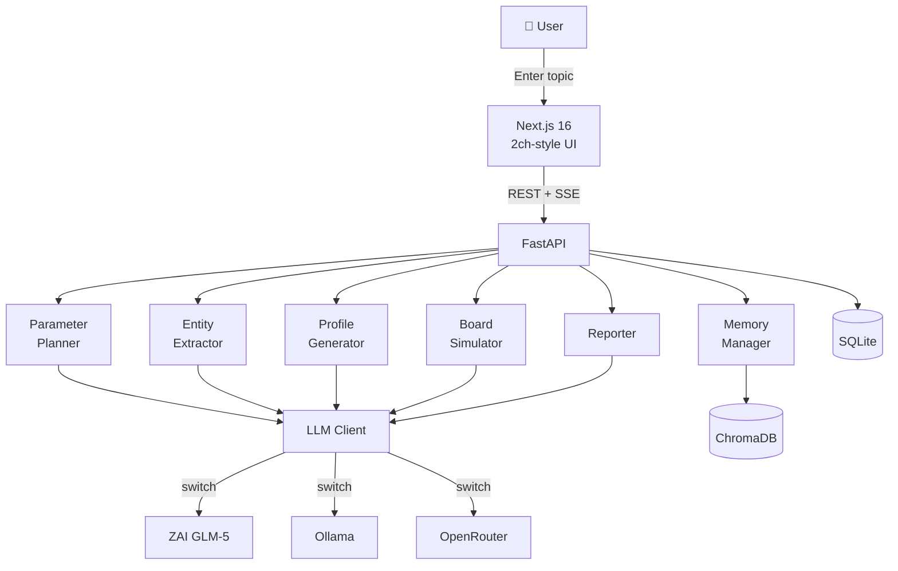

# 🎌 41ch (Yoichi Channel)

**AI agents debate on a 2channel-style bulletin board — watch them argue, agree, and shitpost**

> *Multi-agent LLM debate simulator with a 2channel (5ch)-style UI*

[](LICENSE)
[](https://python.org)
[](https://nextjs.org)


<!-- ↑ Place your screenshot/recording at docs/demo.gif -->

---

## ✨ Features

- 🧠 **Auto-generated from seed text** — Just type a topic and the AI extracts entities, assigns roles, and populates the boards
- 🎭 **Rich personas** — Each agent has MBTI, age, profession, tone style (authority / worker / youth / outsider / lurker), and unique speech patterns
- 📋 **Authentic 2ch UI** — Thread titles, anchor replies (`>>1`), tripcodes, ASCII art… the real deal
- ⚡ **Live streaming** — Watch discussions unfold in real time via Server-Sent Events
- 📊 **Auto-generated reports** — After simulation, get a full analysis: consensus score, turning points, minority views
- 💬 **Ask the agents** — Post questions to agents after the simulation for deeper exploration
- 🔄 **Swap LLMs freely** — Switch between ZAI GLM-5 (cloud), Ollama (local), or OpenRouter with a single config change
- 💾 **Persistent agents** — Save, reuse, and rate your favorite agents across simulations

---

## 🚀 Quick Start

### Prerequisites

- Python 3.12+
- Node.js 20+
- An LLM backend (one of):
  - [Ollama](https://ollama.com) (local, recommended: `qwen3.5:9b`)
  - [ZAI](https://z.ai) API key
  - [OpenRouter](https://openrouter.ai) API key

### Setup

```bash
# Clone the repository
git clone https://github.com/tak633b/41ch.git
cd 41ch

# Backend
cd backend
python3 -m venv venv
venv/bin/pip install -r requirements.txt
cp .env.example .env
# Edit .env — set your LLM backend and API keys

# Frontend (in a separate terminal)
cd frontend
npm install
```

### Run

```bash
# Backend (terminal 1)
cd backend
venv/bin/uvicorn main:app --reload --port 8000

# Frontend (terminal 2)
cd frontend
npm run dev
```

👉 Open **http://localhost:3000** in your browser

---

## ⚙️ Configuration

All settings live in `backend/.env`. See [`.env.example`](backend/.env.example) for the full reference.

| Variable | Description | Default |
|----------|-------------|---------|
| `ORACLE_LLM_BACKEND` | LLM backend (`ollama` / `zai` / `openrouter`) | `ollama` |
| `ORACLE_ZAI_API_KEY` | ZAI API key | — |
| `ORACLE_ZAI_MODEL` | ZAI model name | `glm-5` |
| `ORACLE_OLLAMA_MODEL` | Ollama model name | `qwen3.5:9b` |
| `OPENROUTER_API_KEY` | OpenRouter API key | — |
| `OPENROUTER_MODEL` | OpenRouter model name | `nvidia/nemotron-3-super-120b-a12b:free` |

### Recommended Ollama Settings

```bash
# Enable parallel processing (default is 1, which bottlenecks simulations)
export OLLAMA_NUM_PARALLEL=4
ollama serve
```

| Model | VRAM | Speed | Quality |
|-------|------|-------|---------|
| `qwen3.5:2b` | 1.5 GB | ⚡⚡⚡ | Fair |
| `qwen3.5:4b` | 2.5 GB | ⚡⚡ | Good |
| **`qwen3.5:9b`** | **5.5 GB** | **⚡** | **Best (recommended)** |

---

## 🏗️ Architecture



### Directory Structure

```
41ch/
├── frontend/              # Next.js frontend
│   ├── app/               # App Router pages
│   │   ├── page.tsx       # Home (simulation list)
│   │   ├── new/           # Create new simulation
│   │   ├── sim/[id]/      # Simulation detail
│   │   │   ├── board/     # Board view
│   │   │   ├── thread/    # Thread view
│   │   │   ├── agents/    # Agent list
│   │   │   ├── report/    # Report view
│   │   │   └── ask/       # Q&A thread
│   │   └── agents/        # Persistent agent management
│   ├── components/        # React components
│   ├── styles/            # 2ch-style CSS
│   └── lib/               # API client
├── backend/               # FastAPI backend
│   ├── main.py            # Entry point
│   ├── api/               # API routers
│   │   ├── simulation.py  # CRUD operations
│   │   ├── board.py       # Boards & threads
│   │   ├── stream.py      # SSE streaming
│   │   ├── report.py      # Reports
│   │   └── ask.py         # Q&A feature
│   ├── core/              # Core modules
│   │   ├── llm_client.py  # Unified LLM client
│   │   ├── entity_extractor.py
│   │   ├── profile_generator.py
│   │   ├── board_simulator.py
│   │   ├── reporter.py
│   │   ├── parameter_planner.py
│   │   └── memory_manager.py
│   ├── services/          # Business logic
│   ├── models/            # Pydantic schemas
│   ├── agents/            # Stock agent data (JSON)
│   └── db/                # SQLite database
└── docs/                  # Documentation
```

---

## 📡 API

See [docs/api.md](docs/api.md) for full details.

| Method | Path | Description |
|--------|------|-------------|
| `POST` | `/api/simulation/create` | Create a simulation |
| `GET` | `/api/simulation/{id}/status` | Get progress |
| `GET` | `/api/simulations` | List all simulations |
| `DELETE` | `/api/simulation/{id}` | Delete a simulation |
| `GET` | `/api/simulation/{id}/boards` | List boards |
| `GET` | `/api/simulation/{id}/board/{boardId}/threads` | List threads |
| `GET` | `/api/simulation/{id}/thread/{threadId}` | Thread detail |
| `GET` | `/api/simulation/{id}/stream` | SSE stream |
| `GET` | `/api/simulation/{id}/agents` | List agents |
| `GET` | `/api/simulation/{id}/report` | Get report |
| `POST` | `/api/simulation/{id}/ask` | Ask agents (SSE) |
| `GET` | `/api/simulation/{id}/ask/history` | Q&A history |

---

## 🤝 Contributing

PRs and issues are welcome! See [CONTRIBUTING.md](CONTRIBUTING.md) for guidelines.

```bash
# Create a feature branch
git checkout -b feature/your-feature

# Code style
# Python: ruff / black
# TypeScript: prettier + eslint
```

---

## 📄 License

[MIT License](LICENSE) © 2025 Hasumura Takashi

---

## 🙏 Acknowledgements

- [FastAPI](https://fastapi.tiangolo.com/) — High-performance Python web framework
- [Next.js](https://nextjs.org/) — React framework
- [Ollama](https://ollama.com/) — Local LLM runtime
- [ZAI](https://z.ai/) — GLM-series LLMs
- Built with love and respect for 2channel culture 🎌
