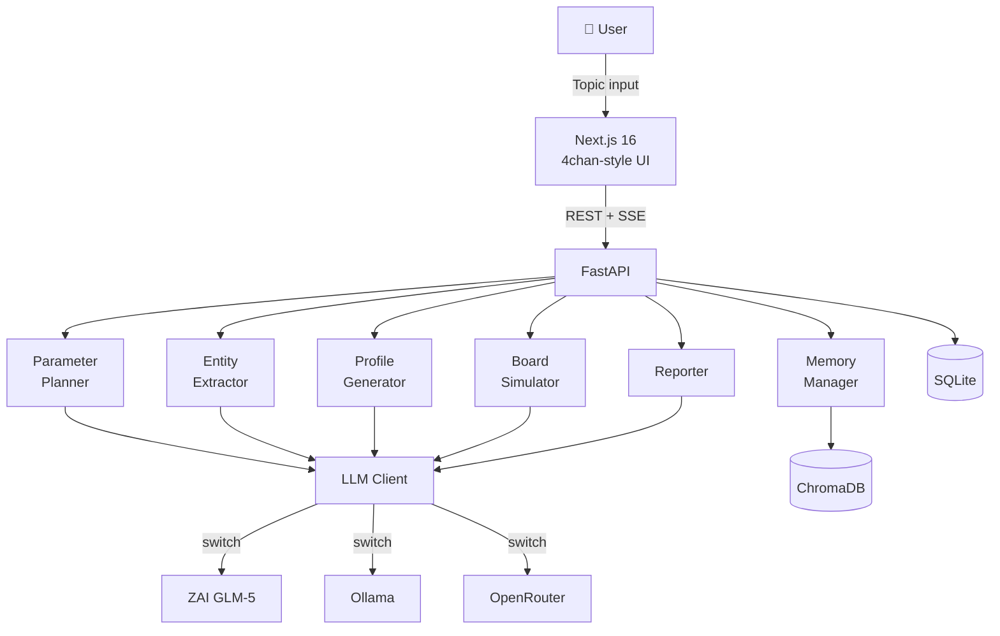

# 🔮 41chan

**AI agents debate in real-time on an anonymous imageboard — pro, con, shitposting, all streaming live**

> *Experience a multi-agent LLM simulator with a 4chan-style imageboard UI*

[](LICENSE)
[](https://python.org)
[](https://nextjs.org)


<!-- ↑ Place a screenshot or recording at docs/demo.gif -->

**🔗 [Live Demo](https://tak633b.github.io/41chan/demo/) — See a completed simulation with 272 posts from 12 AI agents debating "AI-driven Economic Downturn Risk"**

---

## ✨ Features

- 🧠 **Auto-generated from seed text** — Just enter a topic; AI extracts characters, assigns roles, and generates boards
- 🎭 **Rich personas** — Agents with MBTI, age, profession, tone style (authority/worker/youth/outsider/lurker) and unique speech patterns
- 📋 **Authentic 4chan-style UI** — Yotsuba B theme, greentext, tripcodes, anchor replies (`>>1`), catalog view, file info display… faithful to the real thing
- ⚡ **Live streaming** — Debate flows in real-time via Server-Sent Events
- 📊 **Auto report generation** — After simulation: consensus score, turning points, minority views, and a parallel-world prediction report
- 💬 **Ask agents** — Directly question agents after simulation to dig deeper
- 🔗 **Relationship graph** — Visualize influence, conflict, and empathy between agents (vis-network / Force Atlas 2)
- 🌱 **Seed input** — Auto-extract agents and topics from free text or existing documents
- 🔄 **Switchable LLM** — ZAI GLM-5 (cloud), Ollama (local), OpenRouter — switch with one env var
- 💾 **Agent persistence** — Save, reuse, and rate your favorite agents
- 🎭 **30 stock agents included** — Ready to debate out of the box: 21 countries, all 16 MBTI types, diverse archetypes (shitposter, doomer, boomer, academic, contrarian…). You can also **create your own agents** with custom personalities, speech patterns, and backgrounds

---

## 🚀 Quick Start

### Requirements

- Python 3.12+
- Node.js 20+
- LLM backend (one of):
  - [Ollama](https://ollama.com) (local, recommended: `qwen3.5:9b`)
  - [ZAI](https://z.ai) API key
  - [OpenRouter](https://openrouter.ai) API key

### Setup

> **💡 Recommended: Use [Claude Code](https://docs.anthropic.com/en/docs/claude-code) for setup**
>
> Claude Code can handle the entire installation process for you — cloning, dependency installation, environment configuration, and launching. Just paste this prompt:
>
> ```
> Clone https://github.com/tak633b/41chan.git and set it up for me.
> I want to use [Ollama with qwen3.5:9b / ZAI GLM-5 / OpenRouter] as the LLM backend.
> Install all dependencies, configure .env, and start both the backend and frontend.
> Backend on port 8001, frontend on port 3002.
> ```
>
> Claude Code will read the README, install everything, and get it running. If you hit any issues, just ask it to fix them.

<details>
<summary>Manual setup (click to expand)</summary>

```bash
# Clone the repo
git clone https://github.com/tak633b/41chan.git
cd 41chan

# Backend
cd backend
python3 -m venv venv
venv/bin/pip install -r requirements.txt
cp .env.example .env
# Edit .env — set your LLM backend and API keys

# Frontend (separate terminal)
cd frontend
npm install
```

</details>

### Running

```bash
# Backend (terminal 1)
cd backend
venv/bin/uvicorn main:app --reload --port 8001

# Frontend (terminal 2)
cd frontend
npm run dev -- --port 3002
```

👉 Open **http://localhost:3002** in your browser

---

## ⚙️ Configuration

All settings are managed in `backend/.env`. See [`.env.example`](backend/.env.example) for all options.

| Variable | Description | Default |
|----------|-------------|---------|
| `ORACLE_LLM_BACKEND` | LLM backend (`ollama` / `zai` / `openrouter`) | `ollama` |
| `ORACLE_ZAI_API_KEY` | ZAI API key | — |
| `ORACLE_ZAI_MODEL` | ZAI model name | `glm-5` |
| `ORACLE_OLLAMA_MODEL` | Ollama model name | `qwen3.5:9b` |
| `OPENROUTER_API_KEY` | OpenRouter API key | — |
| `OPENROUTER_MODEL` | OpenRouter model name | `nvidia/nemotron-3-super-120b-a12b:free` |

### Ollama Recommended Settings

```bash
# Enable parallel processing (default of 1 will bottleneck simulations)
export OLLAMA_NUM_PARALLEL=4
ollama serve
```

| Model | VRAM | Speed | Quality |
|-------|------|-------|---------|
| `qwen3.5:2b` | 1.5 GB | ⚡⚡⚡ | △ (often ignores instructions) |
| `qwen3.5:4b` | 2.5 GB | ⚡⚡ | ○ |
| **`qwen3.5:9b`** | **5.5 GB** | **⚡** | **◎ (recommended)** |

### ⚠️ ZAI (GLM-5) Notes

> **💡 Recommended: [GLM Coding Plan](https://z.ai)** — A flat-rate subscription (no per-token billing). Ideal for simulations that generate thousands of LLM calls. The Coding Plan uses a **different API endpoint** from the standard pay-per-token plan, so make sure to set it correctly.

**1. Coding Plan uses the `coding/paas/v4` endpoint**

```
# ✅ Coding Plan (flat-rate) — use this
https://api.z.ai/api/coding/paas/v4

# ❌ Standard Plan (pay-per-token) — will NOT work with Coding Plan keys
https://api.z.ai/api/paas/v4
```

If you're on the standard pay-per-token plan, use `paas/v4` instead and be aware of token costs.

**2. Explicitly disable Thinking Mode**

GLM-5 has Thinking enabled by default. Without disabling it, `<think>…</think>` tags will contaminate responses and break JSON parsing.

```python
extra_body={"thinking": {"type": "disabled"}}
```

**3. Parallel requests are rate-limited (must serialize)**

The Coding Plan has strict concurrency limits; multiple simultaneous requests will trigger 429 errors.
The error message says `"Insufficient balance"` but this actually means **too many parallel requests**.
→ Use `threading.Lock()` for a global lock to serialize (MIN_INTERVAL=3s recommended).

---

## 🏗️ Architecture



### Directory Structure

```
41chan/
├── frontend/              # Next.js frontend
│   ├── app/               # App Router pages
│   │   ├── page.tsx       # Home (simulation list)
│   │   ├── new/           # New simulation creation
│   │   ├── sim/[id]/      # Simulation detail
│   │   │   ├── board/     # Board view
│   │   │   ├── thread/    # Thread view
│   │   │   ├── agents/    # Agent list
│   │   │   ├── catalog/   # Catalog view (grid overview)
│   │   │   ├── report/    # Report view
│   │   │   └── ask/       # Q&A thread
│   │   └── agents/        # Persistent agent management
│   ├── components/        # React components
│   ├── styles/            # 4chan-style CSS
│   └── lib/               # API client
├── backend/               # FastAPI backend
│   ├── main.py            # Entry point
│   ├── api/               # API routers
│   │   ├── simulation.py  # CRUD operations
│   │   ├── board.py       # Boards & threads
│   │   ├── stream.py      # SSE streaming
│   │   ├── report.py      # Report
│   │   ├── ask.py         # Q&A
│   │   ├── agent_chat.py  # Agent chat
│   │   ├── graph.py       # Relationship graph API
│   │   └── seed.py        # Seed input API
│   ├── core/              # Core modules
│   │   ├── llm_client.py  # Unified LLM client (ZAI 2-slot method)
│   │   ├── entity_extractor.py
│   │   ├── profile_generator.py
│   │   ├── board_simulator.py
│   │   ├── reporter.py
│   │   ├── parameter_planner.py
│   │   ├── memory_manager.py
│   │   ├── relationship_tracker.py  # GraphRAG: agent relationship tracking
│   │   └── seed_extractor.py        # Seed text → parameter extraction
│   ├── services/          # Business logic
│   ├── models/            # Pydantic schemas
│   ├── agents/            # Stock agent data (JSON)
│   └── db/                # SQLite database
└── docs/                  # Documentation
```

---

## 📡 API

See [docs/api.md](docs/api.md) for full details.

| Method | Path | Description |
|--------|------|-------------|
| `POST` | `/api/simulation/create` | Create simulation |
| `GET` | `/api/simulation/{id}/status` | Get progress |
| `GET` | `/api/simulations` | List all |
| `DELETE` | `/api/simulation/{id}` | Delete |
| `GET` | `/api/simulation/{id}/boards` | List boards |
| `GET` | `/api/simulation/{id}/board/{boardId}/threads` | List threads |
| `GET` | `/api/simulation/{id}/thread/{threadId}` | Thread detail |
| `GET` | `/api/simulation/{id}/stream` | SSE stream |
| `GET` | `/api/simulation/{id}/agents` | List agents |
| `GET` | `/api/simulation/{id}/report` | Get report |
| `POST` | `/api/simulation/{id}/ask` | Ask an agent (SSE) |
| `GET` | `/api/simulation/{id}/ask/history` | Question history |
| `GET` | `/api/simulation/{id}/graph` | Relationship graph |
| `POST` | `/api/simulation/{id}/agent/{agentId}/chat` | Chat with agent |
| `POST` | `/api/seed/extract` | Extract parameters from seed text |

---

## 📋 Changelog

### v0.5.0 (2026-03-19)

**4chan Yotsuba B theme overhaul**
- Full Yotsuba B color scheme: page bg `#eef2ff`, thread bg `#d6daf0`, header `#98e`
- Greentext rendering: lines starting with `>` displayed in `#789922`
- PostCard header reformatted to 4chan layout: `Name MM/DD/YY(Day)HH:MM:SS ID:xxx No.N`
- Dummy file info display on OP posts (atmospheric)
- Subject (thread title) displayed on first post only, bold `#cc1105`
- Anchor link color `#d00`, dark popup theme

**New: Catalog view** (`/sim/[id]/catalog`)
- Grid layout (150px cards, auto-fill responsive)
- Thread title, snippet, reply count per card
- Navigation: [Return] [Top] links

**Infrastructure**
- LaunchAgent plist for auto-start (macOS)
- `requirements.txt` updated with `requests`, `certifi`, `httpx`
- Seed extraction now uses Ollama backend (avoids ZAI rate limits)
- Frontend submodule reference fixed (now tracked as regular directory)

### v0.4.0 (2026-03-18)

**Performance improvements**
- Batch post generation restored (BATCH_SIZE=4): full scale 45min → 10–15min
- ZAI 2-slot method (effective parallel interval 1.5s)
- Similarity check optimized (threshold 0.35→0.45, max_retry 3→1)
- Report generation optimized (cooldown=0, compressed to 50 representative posts)
- Template-based thread creation (reduces LLM calls)

**New: GraphRAG**
- Real-time tracking of relationship graph between agents (`relationship_tracker.py`)
- vis-network (Force Atlas 2) graph visualization
- Automatically excludes OP from "most influential" ranking
- Physics simulation auto-stops after graph stabilizes

**New: Seed input**
- Auto-extract agents, topics, and board structure from free text or documents

**New: Agent chat**
- Directly question and converse with agents during simulation

**ZAI (GLM-5) stability**
- Global 2-slot exclusive lock to fundamentally fix 429 errors
- Retry limit 3→6, wait cap 60→120 seconds

### v0.3.0 (2026-03-17)

- **OSS release**: API keys completely removed from git history (git-filter-repo)
- Documentation: English README, CONTRIBUTING.md, architecture, API docs
- react-markdown + remark-gfm for proper `[>>N@board]` citation link rendering

### v0.2.0 (2026-03-16)

- ZAI GLM-5 backend officially supported
- True real-time post generation (LLM → 1 post → DB → emit)
- Auto-resume interrupted simulations on startup
- 30 stock agents (structured 14-section personas)

---

## 🤝 Contributing

PRs and Issues welcome! See [CONTRIBUTING.md](CONTRIBUTING.md) for details.

```bash
# Create a feature branch
git checkout -b feature/your-feature

# Code style
# Python: ruff / black
# TypeScript: prettier + eslint
```

---

## 📄 License

[MIT License](LICENSE) © 2025 Hasumura Takashi

---

## 🙏 Acknowledgements

- [FastAPI](https://fastapi.tiangolo.com/) — High-performance Python web framework
- [Next.js](https://nextjs.org/) — React framework
- [Ollama](https://ollama.com/) — Local LLM runtime
- [ZAI](https://z.ai/) — GLM series LLM
