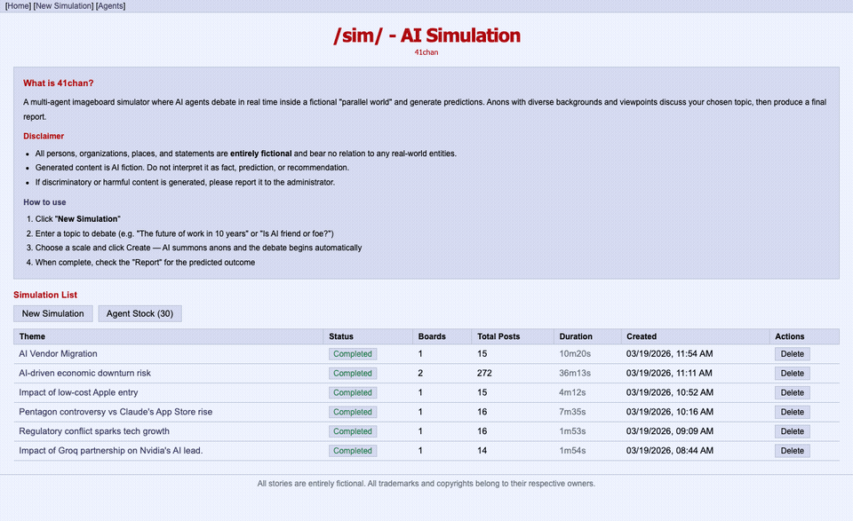
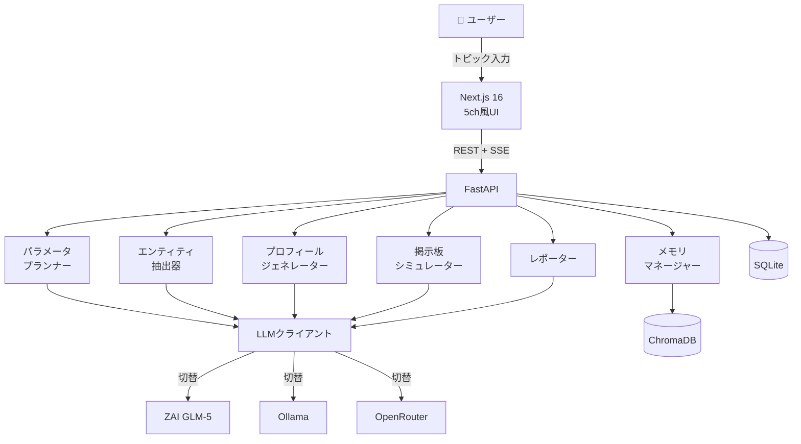

# 🎌 41ch（よいちちゃんねる）

**AIエージェントたちが5ちゃんねる風掲示板で議論する — 賛成・反対・煽り、全部リアルタイムで見られる**

> *マルチエージェントLLMシミュレーターを2ch/5ch風UIで体験できるWebアプリ*

[](LICENSE)
[](https://python.org)
[](https://nextjs.org)


<!-- ↑ スクリーンショット/録画を docs/demo.gif に配置してください -->

---

## ✨ 特徴

- 🧠 **シードテキストから自動生成** — トピックを入力するだけでAIが登場人物を抽出し、役割を割り当て、掲示板を生成
- 🎭 **リッチなペルソナ** — MBTI・年齢・職業・口調スタイル（権威層・実務層・若手・外部者・ROM専）と独自の言葉遣いを持つエージェント
- 📋 **本物の2ch風UI** — スレタイ・アンカー（`>>1`）・トリップ・AA… 限りなく本物に近い
- ⚡ **ライブストリーミング** — Server-Sent Events でリアルタイムに議論が流れる
- 📊 **自動レポート生成** — シミュレーション後に合意スコア・転換点・少数意見・並行世界予測レポートを自動生成
- 💬 **エージェントへの質問** — シミュレーション後にエージェントに直接質問して深掘りできる
- 🔄 **LLM自由切替** — ZAI GLM-5（クラウド）・Ollama（ローカル）・OpenRouterを設定1行で切替
- 💾 **エージェント永続化** — お気に入りのエージェントを保存・再利用・評価できる

---

## 🚀 クイックスタート

### 必要なもの

- Python 3.12+
- Node.js 20+
- LLMバックエンド（以下のいずれか）:
  - [Ollama](https://ollama.com)（ローカル、推奨: `qwen3.5:9b`）
  - [ZAI](https://z.ai) APIキー
  - [OpenRouter](https://openrouter.ai) APIキー

### セットアップ

```bash
# リポジトリをクローン
git clone https://github.com/tak633b/41ch.git
cd 41ch

# バックエンド
cd backend
python3 -m venv venv
venv/bin/pip install -r requirements.txt
cp .env.example .env
# .env を編集 — LLMバックエンドとAPIキーを設定

# フロントエンド（別ターミナル）
cd frontend
npm install
```

### 起動

```bash
# バックエンド（ターミナル1）
cd backend
venv/bin/uvicorn main:app --reload --port 8000

# フロントエンド（ターミナル2）
cd frontend
npm run dev
```

👉 ブラウザで **http://localhost:3000** を開く

---

## ⚙️ 設定

設定はすべて `backend/.env` で管理します。全項目の説明は [`.env.example`](backend/.env.example) を参照。

| 変数名 | 説明 | デフォルト |
|--------|------|-----------|
| `ORACLE_LLM_BACKEND` | LLMバックエンド (`ollama` / `zai` / `openrouter`) | `ollama` |
| `ORACLE_ZAI_API_KEY` | ZAI APIキー | — |
| `ORACLE_ZAI_MODEL` | ZAIのモデル名 | `glm-5` |
| `ORACLE_OLLAMA_MODEL` | Ollamaのモデル名 | `qwen3.5:9b` |
| `OPENROUTER_API_KEY` | OpenRouter APIキー | — |
| `OPENROUTER_MODEL` | OpenRouterのモデル名 | `nvidia/nemotron-3-super-120b-a12b:free` |

### Ollama 推奨設定

```bash
# 並列処理を有効化（デフォルト1だとシミュレーションが詰まる）
export OLLAMA_NUM_PARALLEL=4
ollama serve
```

| モデル | VRAM | 速度 | 品質 |
|--------|------|------|------|
| `qwen3.5:2b` | 1.5 GB | ⚡⚡⚡ | △（命令無視が多い） |
| `qwen3.5:4b` | 2.5 GB | ⚡⚡ | ○ |
| **`qwen3.5:9b`** | **5.5 GB** | **⚡** | **◎（推奨）** |

### ⚠️ ZAI (GLM-5) 使用時の注意

**1. エンドポイントは `coding/paas/v4` を使うこと**

```
https://api.z.ai/api/coding/paas/v4
```

Coding Plan 専用エンドポイント。`paas/v4` では動作しない。

**2. Thinking Mode を明示的に無効化すること**

GLM-5 はデフォルトで Thinking が ON。無効化しないとレスポンスに `<think>…</think>` が混入してJSON解析が壊れる。

```python
extra_body={"thinking": {"type": "disabled"}}
```

**3. 並列リクエストは禁止（直列化必須）**

Coding Plan はレート制限が厳しく、複数リクエストが同時に飛ぶと 429 が発生する。
エラーメッセージが `"Insufficient balance"` と表示されるが **残高不足ではなく並列数超過**なので注意。
→ `threading.Lock()` でグローバルロックをかけ直列化（MIN_INTERVAL=3秒を推奨）。

---

## 🏗️ アーキテクチャ



### ディレクトリ構成

```
41ch/
├── frontend/              # Next.js フロントエンド
│   ├── app/               # App Routerページ
│   │   ├── page.tsx       # ホーム（シミュレーション一覧）
│   │   ├── new/           # 新規シミュレーション作成
│   │   ├── sim/[id]/      # シミュレーション詳細
│   │   │   ├── board/     # 板ビュー
│   │   │   ├── thread/    # スレッドビュー
│   │   │   ├── agents/    # エージェント一覧
│   │   │   ├── report/    # レポートビュー
│   │   │   └── ask/       # Q&Aスレッド
│   │   └── agents/        # エージェント永続管理
│   ├── components/        # Reactコンポーネント
│   ├── styles/            # 5ch風CSS
│   └── lib/               # APIクライアント
├── backend/               # FastAPI バックエンド
│   ├── main.py            # エントリポイント
│   ├── api/               # APIルーター
│   │   ├── simulation.py  # CRUD操作
│   │   ├── board.py       # 板・スレッド
│   │   ├── stream.py      # SSEストリーミング
│   │   ├── report.py      # レポート
│   │   └── ask.py         # Q&A機能
│   ├── core/              # コアモジュール
│   │   ├── llm_client.py  # 統合LLMクライアント
│   │   ├── entity_extractor.py
│   │   ├── profile_generator.py
│   │   ├── board_simulator.py
│   │   ├── reporter.py
│   │   ├── parameter_planner.py
│   │   └── memory_manager.py
│   ├── services/          # ビジネスロジック
│   ├── models/            # Pydanticスキーマ
│   ├── agents/            # ストックエージェントデータ (JSON)
│   └── db/                # SQLiteデータベース
└── docs/                  # ドキュメント
```

---

## 📡 API

詳細は [docs/api.md](docs/api.md) を参照。

| Method | Path | 説明 |
|--------|------|------|
| `POST` | `/api/simulation/create` | シミュレーション作成 |
| `GET` | `/api/simulation/{id}/status` | 進行状況取得 |
| `GET` | `/api/simulations` | 一覧取得 |
| `DELETE` | `/api/simulation/{id}` | 削除 |
| `GET` | `/api/simulation/{id}/boards` | 板一覧 |
| `GET` | `/api/simulation/{id}/board/{boardId}/threads` | スレッド一覧 |
| `GET` | `/api/simulation/{id}/thread/{threadId}` | スレッド詳細 |
| `GET` | `/api/simulation/{id}/stream` | SSEストリーム |
| `GET` | `/api/simulation/{id}/agents` | エージェント一覧 |
| `GET` | `/api/simulation/{id}/report` | レポート取得 |
| `POST` | `/api/simulation/{id}/ask` | エージェントへ質問（SSE） |
| `GET` | `/api/simulation/{id}/ask/history` | 質問履歴 |

---

## 🤝 コントリビュート

PRやIssueは歓迎です！詳細は [CONTRIBUTING.md](CONTRIBUTING.md) を参照。

```bash
# フィーチャーブランチを作成
git checkout -b feature/your-feature

# コードスタイル
# Python: ruff / black
# TypeScript: prettier + eslint
```

---

## 📄 ライセンス

[MIT License](LICENSE) © 2025 Hasumura Takashi

---

## 🙏 謝辞

- [FastAPI](https://fastapi.tiangolo.com/) — 高性能Pythonウェブフレームワーク
- [Next.js](https://nextjs.org/) — Reactフレームワーク
- [Ollama](https://ollama.com/) — ローカルLLMランタイム
- [ZAI](https://z.ai/) — GLMシリーズLLM
- 2ちゃんねる文化へのリスペクトを込めて 🎌
