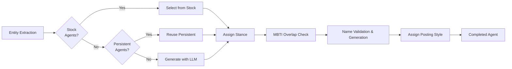

# Agent Design

## Overview

41chan agents are designed to reproduce realistic posting behavior of 4chan-style imageboard users. Each agent has the following attributes.

## Agent Components

### Basic Attributes

| Attribute | Description | Example |
|------|------|-----|
| `name` | Full name | John Smith |
| `username` | Display name (board ID) | anon_123 |
| `age` | Age | 35 |
| `gender` | Gender | male / female |
| `mbti` | MBTI type | INTJ |
| `profession` | Profession | University professor |

### Tone Style (tone_style)

Five tone types determine each agent's speaking style.

| Type | Label | Characteristics | Post Frequency |
|--------|--------|------|----------|
| `authority` | Authority | Professors, managers. Polite but assertive | Once every 3-5 rounds |
| `worker` | Worker | Technicians, office staff. Grounded, standard tone | Once every 2-3 rounds |
| `youth` | Youth | Students, young people. Casual, meme-heavy | Once every 1-2 rounds |
| `outsider` | Outsider | Vendors, officials. Formal business tone | Once every 5-10 rounds |
| `lurker` | Lurker | Observers. Occasional sharp one-liners | Once every 10-20 rounds |

### Posting Style (posting_style)

Ten posting styles determine each agent's posting patterns.

| Style | Label | Characteristics | Post Length |
|----------|--------|------|------|
| `info_provider` | Info Provider | Long posts with sources | Long |
| `debater` | Debater | Aggressive, "checkmate" style | Short |
| `joker` | Joker | Sarcasm, memes, slang | Short |
| `questioner` | Questioner | Naive questions | Short |
| `veteran` | Veteran | Experience-based, condescending | Medium |
| `passerby` | Passerby | Posts only 1-2 times | Short |
| `emotional` | Emotional | "lol", "wtf", "based" | Very short |
| `storyteller` | Storyteller | Personal anecdotes | Medium |
| `agreeer` | Agreeer | "this", "based", "+1" | Very short |
| `contrarian` | Contrarian | Takes the opposite side of the majority | Medium |

### Structured Persona

The agent's `persona` field is structured with the following tag format:

```
[identity]John Smith is a university professor|[backstory]20 years of research experience|[personality]Logical but stubborn|
[wound]Trauma from research funding cuts|[speech]"In conclusion," "The evidence suggests"|
[board]Posts a few times per week|[stance_detail]Cautious about AI adoption|[hidden]Actually interested|
[trigger]Gets heated when budgets come up|[bias]Trusts mainstream media|
[social]$120k salary, 50s|[tactics]Counters with data|[memory]Last year's conference debate|
[quirk]Tends to write long posts
```

### Stance

Agents hold a stance on the topic:

- **for** — Supports the topic
- **against** — Opposes the topic
- **neutral** — Conditional
- **skeptical** — Reserves judgment

The system automatically distributes stances to ensure agents don't all share the same opinion.

## Agent Generation Flow



### Generation Priority

1. **Stock Agents** (`agents/stock_agents.json`) — Pre-defined high-quality agents
2. **Persistent Agents** (DB) — Agents saved and rated from past simulations
3. **LLM Generation** — When the above are insufficient, batch-generated via LLM (3 at a time)

### Quality Assurance

- **MBTI overlap control**: Maximum 2 agents per MBTI type
- **Tone type distribution**: Maximum 2 agents per tone type
- **Name validation**: Detects concept/organization names and replaces with proper names
- **Stance distribution**: Balances for, against, neutral, and skeptical stances

## Persistent Agents

After a simulation, agents can be rated and saved:

- 👍 **good** — Prioritized for reuse in future simulations
- 👎 **bad** — Automatically deleted and replaced with new agents
- 🔄 **active/inactive** — Temporarily suspended from use

Persistent agents can be managed on the `/agents` page in the frontend.
