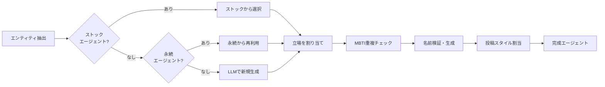

# エージェント設計 / Agent Design

## 概要

41ch のエージェントは、5ちゃんねる住民のリアルな投稿行動を再現するために設計されています。各エージェントは以下の要素を持ちます。

## エージェント構成要素

### 基本属性

| 属性 | 説明 | 例 |
|------|------|-----|
| `name` | 日本人フルネーム | 田中太郎 |
| `username` | コテハン（掲示板ID） | tanaka_123 |
| `age` | 年齢 | 35 |
| `gender` | 性別 | male / female |
| `mbti` | MBTIタイプ | INTJ |
| `profession` | 職業 | 大学教授 |

### 口調タイプ（tone_style）

5種類の口調タイプがエージェントの発言スタイルを決定します。

| タイプ | ラベル | 特徴 | 投稿頻度 |
|--------|--------|------|----------|
| `authority` | 権威層 | 教授・管理職。丁寧だが断定的 | 3-5ラウンドに1回 |
| `worker` | 実務層 | 技術員・事務職。現場感のある標準語 | 2-3ラウンドに1回 |
| `youth` | 若手層 | 学生・若手。なんJ寄りカジュアル | 1-2ラウンドに1回 |
| `outsider` | 外部者 | 業者・行政。ビジネス丁寧語 | 5-10ラウンドに1回 |
| `lurker` | ROM専 | 観察者。たまに鋭い一言 | 10-20ラウンドに1回 |

### 投稿スタイル（posting_style）

10種類の投稿スタイルがエージェントの書き込みパターンを決定します。

| スタイル | ラベル | 特徴 | 文長 |
|----------|--------|------|------|
| `info_provider` | 情報提供者 | ソース付き長文 | 長い |
| `debater` | レスバ戦士 | 攻撃的、「はい論破」 | 短い |
| `joker` | ネタ師 | 皮肉、ネットスラング | 短い |
| `questioner` | 質問者 | 素朴な疑問 | 短い |
| `veteran` | 古参 | 経験ベース、上から目線 | 中程度 |
| `passerby` | 通りすがり | 1-2回だけ投稿 | 短い |
| `emotional` | 感情的反応者 | 「ワロタ」「マジかよ」 | 極短 |
| `storyteller` | 自分語り | 体験談ベース | 中程度 |
| `agreeer` | 同意マン | 「それな」「ほんこれ」 | 極短 |
| `contrarian` | 逆張り | 多数派と逆の意見 | 中程度 |

### 構造化ペルソナ

エージェントの `persona` フィールドは以下のタグ形式で構造化されています:

```
[identity]田中太郎は大学教授|[backstory]20年の研究歴|[personality]論理的だが頑固|
[wound]研究費カットのトラウマ|[speech]「結論から言うと」「エビデンスは」|
[board]週に数回書き込む|[stance_detail]AI活用に慎重|[hidden]実は興味がある|
[trigger]予算の話になると熱くなる|[bias]日経新聞を信頼|
[social]年収800万・50代|[tactics]データで反論|[memory]去年の学会での議論|
[quirk]長文になりがち
```

### 立場（stance）

エージェントはテーマに対する立場を持ちます:

- **賛成** — テーマを支持
- **反対** — テーマに反対
- **中立** — 条件付き
- **懐疑** — 判断保留

立場はシステムが自動的に分散させ、全員が同じ意見にならないようにします。

## エージェントの生成フロー



### 生成の優先順位

1. **ストックエージェント** (`agents/stock_agents.json`) — 事前定義済みの高品質エージェント
2. **永続エージェント** (DB) — 過去のシミュレーションで保存・評価されたエージェント
3. **LLM生成** — 上記が不足する場合、LLMでバッチ生成（3人ずつ）

### 品質保証

- **MBTI重複制御**: 同じMBTIタイプは最大2人まで
- **口調タイプ分散**: 同じ口調タイプは最大2人まで
- **名前検証**: 概念名・組織名を検出して日本人名に置換
- **立場分散**: 賛成・反対・中立・懐疑をバランスよく配置

## 永続エージェント

シミュレーション後、エージェントを評価・保存できます:

- 👍 **good** — 次回のシミュレーションで優先的に再利用
- 👎 **bad** — 自動削除して新しいエージェントに入れ替え
- 🔄 **アクティブ/休止** — 一時的に使用停止

永続エージェントはフロントエンドの `/agents` ページで管理できます。
