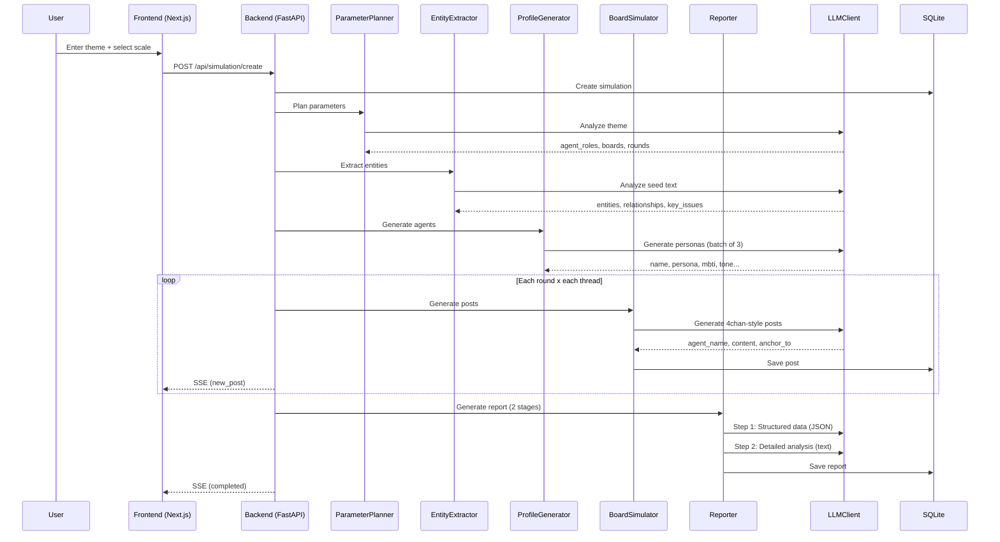

# Architecture

## System Overview

41chan operates as a 4-stage pipeline: Seed Text → Agent Generation → Board Simulation → Report Generation.

## Processing Flow

## Core Modules

### LLMClient (`core/llm_client.py`)

Unified LLM client. Switches between ZAI / Ollama / OpenRouter with a single interface.

- **ZAI**: OpenAI-compatible API, global lock for serialization (429 prevention)
- **Ollama**: Native API direct calls, automatic `<think>` tag removal
- **OpenRouter**: OpenAI-compatible API
- Automatic retry with exponential backoff for all backends

### EntityExtractor (`core/entity_extractor.py`)

Extracts entities (people, organizations, concepts) and relationships from seed text.

- Output: `entities[]`, `relationships[]`, `theme`, `key_issues[]`

### ParameterPlanner (`core/parameter_planner.py`)

Automatically determines simulation parameters from the theme.

- Plans agent count, role distribution, board structure, and round count in a single LLM call
- Auto-generates 4chan-style thread titles (e.g., "[Serious]", "ITT:", "BREAKING:" etc.)

### ProfileGenerator (`core/profile_generator.py`)

Generates realistic agent profiles from entities.

- 5 tone types: authority / worker / youth / outsider / lurker
- 10 posting styles: info_provider / debater / joker / questioner / veteran / passerby / emotional / storyteller / agreeer / contrarian
- MBTI overlap control, automatic name generation, stance distribution
- Stock agent reuse support

### BoardSimulator (`core/board_simulator.py`)

Generates 4chan-style posts per thread.

- Quote replies (`>>N`), greentext, memes, slang
- Per-agent post frequency and writing style control
- Round-based gradual discussion progression

### MemoryManager (`core/memory_manager.py`)

Manages agent memory.

- Time-series management via SQLite
- Semantic search via ChromaDB (optional)
- Auto-summarization when exceeding 10 entries

### Reporter (`core/reporter.py`)

Generates analysis reports from simulation results.

- Step 1: Structured data (JSON) — consensus level, turning points, minority views
- Step 2: Detailed analysis (text) — written as a record of a virtual parallel world

## Database

Uses SQLite. Main tables:

- `simulations` — Simulation management
- `boards` — Boards
- `threads` — Threads
- `posts` — Posts
- `agents` — Agents (per simulation)
- `persistent_agents` — Persistent agents
- `reports` — Reports
- `ask_history` — Question history

## Frontend

Next.js 16 App Router + TailwindCSS + custom 4chan CSS.

- `/` — Simulation list
- `/new` — Create new simulation
- `/sim/[id]` — Details (board list, real-time progress)
- `/sim/[id]/board/[boardId]` — Thread list
- `/sim/[id]/thread/[threadId]` — Thread view
- `/sim/[id]/agents` — Agent list
- `/sim/[id]/report` — Report
- `/sim/[id]/ask` — Ask thread
- `/agents` — Persistent agent management
