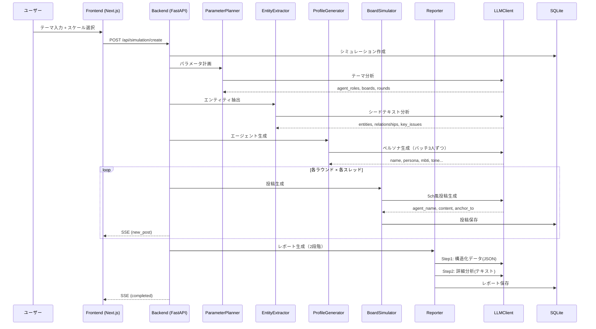

# アーキテクチャ / Architecture

## システム概要

41ch は「シードテキスト → エージェント生成 → 掲示板シミュレーション → レポート生成」の4段階パイプラインで動作します。

## 処理フロー

## コアモジュール

### LLMClient (`core/llm_client.py`)

統一LLMクライアント。ZAI / Ollama / OpenRouter を同一インターフェースで切替。

- **ZAI**: OpenAI互換API、グローバルロックで直列化（429防止）
- **Ollama**: ネイティブAPI直接呼び出し、`<think>` タグ自動除去
- **OpenRouter**: OpenAI互換API
- 全バックエンドで自動リトライ（指数バックオフ）

### EntityExtractor (`core/entity_extractor.py`)

シードテキストからエンティティ（人物・組織・概念）と関係性を抽出。

- 出力: `entities[]`, `relationships[]`, `theme`, `key_issues[]`

### ParameterPlanner (`core/parameter_planner.py`)

テーマからシミュレーションパラメータを自動決定。

- エージェント数、役割配分、板構成、ラウンド数を1回のLLM呼び出しで計画
- 5ch風スレタイ（【悲報】【朗報】等）を自動生成

### ProfileGenerator (`core/profile_generator.py`)

エンティティからリアルなエージェントプロファイルを生成。

- 5口調タイプ: authority / worker / youth / outsider / lurker
- 10投稿スタイル: info_provider / debater / joker / questioner / veteran / passerby / emotional / storyteller / agreeer / contrarian
- MBTI重複制御、日本人名自動生成、立場分散
- ストックエージェント再利用対応

### BoardSimulator (`core/board_simulator.py`)

スレッド単位で5ch風投稿を生成。

- アンカー返信 (`>>N`)、AA、ネットスラング
- エージェントごとの投稿頻度・文体制御
- ラウンド制で段階的に議論を深化

### MemoryManager (`core/memory_manager.py`)

エージェントの記憶を管理。

- SQLiteによる時系列管理
- ChromaDB（オプション）によるセマンティック検索
- 10件超で自動要約

### Reporter (`core/reporter.py`)

シミュレーション結果から分析レポートを生成。

- Step 1: 構造化データ（JSON）— 合意度、転換点、少数意見
- Step 2: 詳細分析（テキスト）— バーチャル並行世界の記録として執筆

## データベース

SQLite を使用。主要テーブル:

- `simulations` — シミュレーション管理
- `boards` — 板
- `threads` — スレッド
- `posts` — 投稿
- `agents` — エージェント（シミュレーション単位）
- `persistent_agents` — 永続エージェント
- `reports` — レポート
- `ask_history` — 質問履歴

## フロントエンド

Next.js 16 App Router + TailwindCSS + カスタム5ch CSS。

- `/` — シミュレーション一覧
- `/new` — 新規作成
- `/sim/[id]` — 詳細（板一覧、リアルタイム進行）
- `/sim/[id]/board/[boardId]` — スレッド一覧
- `/sim/[id]/thread/[threadId]` — スレッド表示
- `/sim/[id]/agents` — エージェント一覧
- `/sim/[id]/report` — レポート
- `/sim/[id]/ask` — 質問スレ
- `/agents` — 永続エージェント管理
